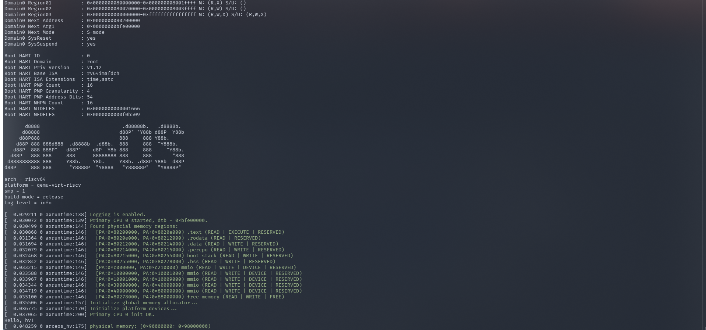

## RISC-V的H拓展

虚拟化要求在 OS 与硬件之间添加一个可统筹管理 OS 的 hypervisor，此时的 OS 被称为客户操作系统（Guest OS），后续简称为 Guest。这样一来，在同一个硬件上就可以同时运行多个互相独立的 Guest，每个 Guest 都认为自己是一台独立的机器，这便实现了所谓的虚拟化。此时，硬件仍旧运行在 M-mode，supervisor 则运行在 HS-mode (Hypervisor-extended Supervisor mode)，对应的原来分别运行于 S-mode 和 U-mode 的 OS 和应用程序则在此处被标记为 VS-mode (Virtual Supervisor) 和 VU-mode (Virtual User mode)。

### Trap

正常情况下 trap 都会导致 hart 的控制转移至 M-mode，处理之后通过 `mret` 指令返回到原来的模式。

特殊情况下 trap 会经由 `mdeleg` 或 `mideleg` 委派从 HS-mode 或 VS-mode 转移至 HS-mode，或再经由 `hedeleg` 或 `hideleg` 委派从 VU-mode 转移至 VS-mode。

被委派至 HS-mode 和 VS-mode 的 trap 在处理完毕后，将通过 `sret` 指令返回至 trap 之前的模式。


trap 到 **M-mode**, V=0, **`msatatus`**’s fields MPV (Machine Previous Virtualization), MPP (Machine Previous Previlige) 依据下表设置：

| Previous Mode | msatatus.MPV | msatatus.MPP |
| :------------ | :----------- | :----------- |
| U-mode        | 0            | 0            |
| HS-mode       | 0            | 1            |
| M-Mode        | 0            | 3            |
| VU-mode       | 1            | 0            |
| VS-mode       | 1            | 1            |

并修改 `mstatus` 的 GVA, MIE, MPIE 位，修改 CSR `mepc`, `mcause`, `mtval`, `mtval2`, `mtinst`.

trap 到 **HS-mode**, V=0, **`hstatus`** 的 MPV 和 MPP 位调整如下：

| Previous Mode | hstatus.SPV | hstatus.SPP |
| :------------ | :---------- | :---------- |
| U-mode        | 0           | 0           |
| HS-mode       | 0           | 1           |
| VU-mode       | 1           | 0           |
| VS-mode       | 1           | 1           |

若 trap 前 V=1，`hstatus.SPVP = sstatus.SPP`；若 trap 前 V=0，保持不变。

trap 到 HS-mode 要求写 `hstatus.GVA`, `sstatus.SIE`, `sstatus.SPIE` 和 CSR `sepc`, `scause`, `stval`, `htval`, `htinst`。

trap 到 **VS-mode**，`vsstatus.SPP` 依照下表设置：

| Previous Mode | vsstatus.SPP |
| :------------ | :----------- |
| VU-mode       | 0            |
| VS-mode       | 1            |

`hstatus`, `sstatus` 不修改，V=1；写 `vsstatus.PIE`, `vsstatus.SPIE` 和 CSR `vsepc`, `vscause`, `vstval`。

### 内存虚拟化

#### XATP

处于X特权级下的地址转换与保护控制状态寄存器。

SATP用于控制S-mode下地址转换与保护

| Field Name | Width (32) | Range (32) | Width (64) | Range (64) | Function                                                     |
| :--------- | :--------- | :--------- | :--------- | :--------- | :----------------------------------------------------------- |
| MODE       | 1          | 31         | 4          | 63:60      | selects the address-translation scheme                       |
| ASID       | 9          | 30:22      | 16         | 59:44      | **address space identifier**, which facilitates address-translation fences on a per-address-space basis |
| PPN        | 22         | 21:0       | 44         | 43:0       | hold the **page table number** of the root page table, i.e., its supervisor physical address divided by 4 KiB |

Mode位用于标记当前系统使用的内存模式


`satp`的值在`S-Mode U-mode`有效

`hatp`的`VMID`位进行了两位的拓展， 留出两位后剩下的用于保存`Virtual Machine Identifier`


V=1 时，`vsatp` 将取代 `satp`，所有对 `satp` 的操作（读写）将在 `vsatp` 上完成。`vsatp` 将用于 VS-Stage 的地址转换。

仅当处于 U 特权模式且 `hstatus.HU=0` 时，`vsatp` 才被视作无效状态。

### 两阶段地址转换

虚拟机里的虚拟地址访问需要经历`VS`和`G`两个阶段的转换， 分别由`vsatp`和`hgatp`控制， 由original virtual address, VA --> guest physical address, GPA -> supervisor physical address, SPA, 分别记为`VS-Stage`和`G-Stage`

SPA可以认为是被hypervisor管理的物理地址(Hypervisor Physical Address), SPA是ISA的说法， 反正意思就是最终的转换结果， 可以认为是实际的物理地址

当V = 1时， 两段地址转换视为生效状态， 绕过地址转换的访问将只与`G-Stage`有关（比如说只对VS级的页表进行读写的操作）

VS-Stage的地址转换和S-Mode下的大致相同， 但是会从`vsatp`处获得根页表地址

G-Stage的转换由hgatp控制， 不同之处在该阶段的虚拟地址相较于原有的地址转换需要扩宽两位， 称为是Sv32x4, Sv39x4, Sv48x4，和 Sv57x4 转换机制。与之对应的根页表的大小也随之扩大至 16 KiB 而非原来的 4 KiB，但其它各级页表的大小保持不变。根页表也需要与 16 KiB 的页边界对齐。

以及以下的不同：

- `hgatp` 代替 `satp` 用于获取根页表的 PPN。
- 这一阶段翻译的起始特权级应该 VU 或 VS，即处于虚拟态，V=1。
- 当进行 PTE.U（页表项中表示是否可被 U-Mode 程序访问）的访问时，特权级会变为 U-Mode，即所有的内存访问都被视为 U-Mode 的访问。
- 出现异常时将会是 `guest-page-fault exceptions` 而非 `page-fault exceptions`。


## 练习1

1. 在`arceos`中运行linux



2. 以前有M,S,U模式， 添加了若干个CSR寄存器， 让S模式拥有了虚拟化能力， 此时修改过的特权级是HS模式， 另外增加了VS和VU两个模式， 分别代表运行在虚拟化技术上的S和U模式。 VS VU模式的特权级低于HS模式。hypercraft是运行在具有虚拟化功能的操作系统上的， 所以是属于type 2.

## 练习2

初始化`vcpu`的代码是在`src/arch/riscv/vcpu.rs`的226行的`new`位置：

227行生成一个默认的`VmCpuRegisters`, 初始全为$0$

首先看`VmCpuRegisters`这个结构体， 它拥有五个字段:

```rust
#[derive(Default)]
#[repr(C)]
pub struct VmCpuRegisters {
    // CPU state that's shared between our's and the guest's execution environment. Saved/restored
    // when entering/exiting a VM.
    hyp_regs: HypervisorCpuState,
    guest_regs: GuestCpuState,

    // CPU state that only applies when V=1, e.g. the VS-level CSRs. Saved/restored on activation of
    // the vCPU.
    vs_csrs: GuestVsCsrs,

    // Virtualized HS-level CPU state.
    virtual_hs_csrs: GuestVirtualHsCsrs,

    // Read on VM exit.
    trap_csrs: VmCpuTrapState,
}
```

```rust
#[derive(Default)]
#[repr(C)]
struct HypervisorCpuState {
    gprs: GeneralPurposeRegisters,
    sstatus: usize,
    hstatus: usize,
    scounteren: usize,
    stvec: usize,
    sscratch: usize,
}
```

```rust
struct GuestCpuState {
    gprs: GeneralPurposeRegisters,
    sstatus: usize,
    hstatus: usize,
    scounteren: usize,
    sepc: usize,
}
```

```rust
#[derive(Default)]
#[repr(C)]
pub struct GuestVsCsrs {
    htimedelta: usize,
    vsstatus: usize,
    vsie: usize,
    vstvec: usize,
    vsscratch: usize,
    vsepc: usize,
    vscause: usize,
    vstval: usize,
    vsatp: usize,
    vstimecmp: usize,
}
```

```rust
#[derive(Default)]
#[repr(C)]
pub struct GuestVirtualHsCsrs {
    hie: usize,
    hgeie: usize,
    hgatp: usize,
}
```

```rust
/// CSRs written on an exit from virtualization that are used by the hypervisor to determine the cause
/// of the trap.
#[derive(Default, Clone)]
#[repr(C)]
pub struct VmCpuTrapState {
    pub scause: usize,
    pub stval: usize,
    pub htval: usize,
    pub htinst: usize,
}
```

然后复制出`hstatus`寄存器的值

然后修改`hstatus`的`spv`字段和`spvp`字段

在trap到`HS-mode`的时候会涉及到写入: `sstatus.SPP`在`trap`时会被设置到trap对应的名义特权级， 此时`hstatus.SPV`就会设置到trap时的`V`值， 在这里设置`V`为`1`

`SPVP` V = 1时行为和`sstatus.SPP`相同， 置为trap时的名义特权级， V = 0时候保持不变

`A0`和`A1`保存`hart id`和`dtb`(约定)

**RISC-V ISA**将包含一个独立的取值单元的组件定义为`core`, 而一个`core`可以通过多线程的方式支持多个兼容`RISC-V`的硬件线程， 这样的硬件线程定义为一个`hart (hardware thread)`

为方便给需要用到的结构体实现一下`Debug`

```rust
impl Debug for GeneralPurposeRegisters {
    fn fmt(&self, f: &mut Formatter<'_>) -> core::fmt::Result {
        write!(f, "GeneralPurposeRegisters [\t\n")?;

        for (i, &value) in self.0.iter().enumerate() {
            let register = match GprIndex::from_raw(i as u32) {
                Some(index) => index,
                None => panic!(""),
            };

            write!(f, "{:#?}: {:032b},", register, value)?;

            if i < self.0.len() - 1 {
                write!(f, "\n")?;
            }
        }

        write!(f, "]")
    }
}

impl fmt::Debug for HypervisorCpuState {
    fn fmt(&self, f: &mut fmt::Formatter<'_>) -> fmt::Result {
        write!(f, "HypervisorCpuState {{ \n")?;
        write!(f, "gprs: {:?} \n", self.gprs)?;
        write!(f, "sstatus: {:032b} \n", self.sstatus)?;
        write!(f, "hstatus: {:032b} \n", self.hstatus)?;
        write!(f, "scounteren: {:032b} \n", self.scounteren)?;
        write!(f, "stvec: {:032b} \n", self.stvec)?;
        write!(f, "sscratch: {:032b} }} \n", self.sscratch)
    }
}
```


根据输出可以得知，在初始化后主要改变的就是`sstatus`, `hstatus`, `spec`, 其中`sstatus`和`hstatus`是跟特权级有关， 而`sepc`是用于记录触发中断的指令的地址的， 用于恢复。

在初始化分页系统后， 也改变了一个寄存器的值就是`hgatp`, 设置`mode`为$8$采用了`Sv39x4`模式， 后面是根页表的`PPN`， 物理页面编号

### 练习三

异常类型参阅`csrs.rs`的末尾

```rust
pub mod traps {
    pub mod interrupt {
        pub const USER_SOFT: usize = 1 << 0;
        pub const SUPERVISOR_SOFT: usize = 1 << 1;
        pub const VIRTUAL_SUPERVISOR_SOFT: usize = 1 << 2;
        pub const MACHINE_SOFT: usize = 1 << 3;
        pub const USER_TIMER: usize = 1 << 4;
        pub const SUPERVISOR_TIMER: usize = 1 << 5;
        pub const VIRTUAL_SUPERVISOR_TIMER: usize = 1 << 6;
        pub const MACHINE_TIMER: usize = 1 << 7;
        pub const USER_EXTERNAL: usize = 1 << 8;
        pub const SUPERVISOR_EXTERNAL: usize = 1 << 9;
        pub const VIRTUAL_SUPERVISOR_EXTERNAL: usize = 1 << 10;
        pub const MACHINEL_EXTERNAL: usize = 1 << 11;
        pub const SUPERVISOR_GUEST_EXTERNEL: usize = 1 << 12;
    }

    pub mod exception {
        pub const INST_ADDR_MISALIGN: usize = 1 << 0;
        pub const INST_ACCESSS_FAULT: usize = 1 << 1;
        pub const ILLEGAL_INST: usize = 1 << 2;
        pub const BREAKPOINT: usize = 1 << 3;
        pub const LOAD_ADDR_MISALIGNED: usize = 1 << 4;
        pub const LOAD_ACCESS_FAULT: usize = 1 << 5;
        pub const STORE_ADDR_MISALIGNED: usize = 1 << 6;
        pub const STORE_ACCESS_FAULT: usize = 1 << 7;
        pub const ENV_CALL_FROM_U_OR_VU: usize = 1 << 8;
        pub const ENV_CALL_FROM_HS: usize = 1 << 9;
        pub const ENV_CALL_FROM_VS: usize = 1 << 10;
        pub const ENV_CALL_FROM_M: usize = 1 << 11;
        pub const INST_PAGE_FAULT: usize = 1 << 12;
        pub const LOAD_PAGE_FAULT: usize = 1 << 13;
        pub const STORE_PAGE_FAULT: usize = 1 << 15;
        pub const INST_GUEST_PAGE_FAULT: usize = 1 << 20;
        pub const LOAD_GUEST_PAGE_FAULT: usize = 1 << 21;
        pub const VIRTUAL_INST: usize = 1 << 22;
        pub const STORE_GUEST_PAGE_FAULT: usize = 1 << 23;
    }
}
```

如果没有虚拟化时处理异常的流程

M模式下

- 跳转到`mtvec`寄存器定义的`PC`地址开始执行
- 记录异常原因到`mcaust`
- 记录返回地址到`mepc`
- 记录异常发生时的访问地址或者指令到`mtval`
- 更新`mstatus`

而也可以选择让S模式代理异常处理

- `mideleg`寄存器指示代理哪些中断给S模式

具体过程

- 某个 trap 被委托给了模式 `x`，并且在执行过程中触发
- `xcause` 寄存器更新，写入 trap 的起因
- `xepc` 寄存器更新，写入 trap 发生时指令的地址（虚拟地址）
- `xtval` 寄存器更新，写入 trap 对应的处理程序位置
- `mstatus.xPP` 写入在发生 trap 时的特权级别
- `mstatus.xPIE` 写入 `xIE` 的值，而 `xIE` 的值被清除
- **注意：`mcause` 和 `mepc` 以及 MPP MPIE 域不会更新**

而在有虚拟化情况下：

当一次Trap发生在HS-mode 或是 U-mode时一般会进入M-mode, ，除非这个trap通过`medeleg` or `mideleg`委托给了`HS-mode`处理。 当一次`Trap`发生在VS-mode或VU-mode, 会进入M-mode, 除非这个trap通过`medeleg`或者`mideleg`委托给了HS-mode, 如果再通过`hedeleg` or `hideleg`委托就会进入VS-mode处理

当在M-mode处理trap时， 设置V = 0, 然后如下表设置mstatus的`MPV and MPP`， 也会写入`mstatus`的`GVA MPIE MIE`, 和写入`mepc, mcause, mtval, mtval2, mtinst`

当在HS-mode处理时， 设置V = 0, 然后如表设置`hstatus.SPV and sstatus.SPP`, 如果`trap`前V = 1, `hstatus.SPVP = sstatus.SPP`, ，否则不变。 也会写入`htatus.GVA, sstatus.SPIE&SIE`, `spec, scause, stval, htval`

当在VS-mode处理时， 设置`vsstatus.SPP`, 不改变`hstatus sstatus`和V, 修改`vsstatus.SPIE&SIE`和`vsepc, vscause, vstval`

### 练习4

三级页表 -> 二级页表 -> 一级页表， 三次访存查询到guest physical address, 然后再获取到真实地址一共3 + 3 = 6次....吗？

然而我觉得没有这么简单。 要获得下一级页表的地址， 必须要切实地去查页表， 而要查也就是说要获取到页表的真实物理地址才行。

每一次访问页表查出下一级页表的地址都是这样的流程：

已有地址 -> 二级虚拟地址 -> 真实地址 -> 取出下一级页表的虚拟地址

也就是说每一次查下一级页表的地址都需要三次访存从真实地址中取出下一级页表的虚拟地址...

这样完成一次转换起码就得15次访存

```
GVA             -------> GL3  -------> GL2 --------> GL1
|               |         |   |         |             |
---------> MMU --------> MMU --------> MMU --------> MMU
			|   |         |   |         |   |         |
			L3  |         L3  |         L3  |         L3
			|   |         |   |         |   |         |
			L2  |         L2  |         L2  |         L2
			|   |         |   |         |   |         |
			L1  |         L1  |         L1  |         L1
			|   |         |   |         |   |         |
			-----         -----         -----         HPA
			                                          |
			                                          (Content)
```

